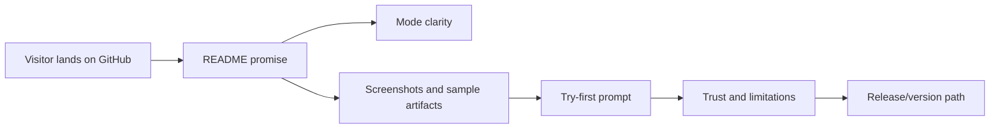

# Plan: GitHub Marketing Presence

**Status:** Draft · **rev 2** · _2026-06-26_
**Owner:** Codex
**Canonical:** this markdown is the SOURCE OF TRUTH. The sibling `<this-file>.html` and `<this-file>.tracker.html` are GENERATED from it by `scripts/render_plan` — never hand-edit the HTML.
**Global validation gate:** `npm run verify` plus `git diff --check`, `scripts/render_plan --check docs/plans/github-marketing.md`, and `workflow/bin/review.sh` before merge.

> How to read this plan: each milestone is an independently reviewable PR landing in dependency order. A task is `[x]` only when its phase's Testing Strategy holds AND the global validation gate passes. This plan is adversarially reviewed BEFORE any code is written, and each milestone's diff is reviewed BEFORE merge.

**Status markers:** `[ ]` todo · `[wip]` in progress · `[x]` done · `[f]` failed / blocked _(renderer treats `[]` as `[ ]`)_

---

## 1. Goal & success criteria
- **Problem:** Panely's public GitHub presence now has a stronger README, but it still lacks the assets and proof that help a broad public audience quickly understand the product, trust its claims, and see how it can help with difficult decisions across life and work. It also needs an honest release/versioning story that does not overstate product maturity.
- **Done looks like:** A visitor can land on GitHub, understand Panely in under one minute, see real product screenshots or GIFs, inspect sanitized example artifacts, try a nontechnical first prompt, understand the three modes, understand local-first/provider limits, and see a coherent release/version path toward `v1.0.0`.
- **Acceptance:** The README, GitHub metadata, example docs, screenshots, and release docs are internally consistent, free of abandoned hosted-SaaS claims, grounded in current product behavior, validated with the full gate, and approved by adversarial review with no blocking findings. A nontechnical reviewer can answer: what Panely is, whether they can use it today, what they get back, what may leave their machine, and what Panely should not be used for.

## 2. Scope
- **In scope:** GitHub README, repo description/topics/homepage metadata proposals, screenshot/GIF assets, deterministic sanitized fixtures or capture scripts, sanitized sample artifacts, `docs/examples/`, a public claim/proof matrix, release/versioning docs, changelog updates, and PR copy.
- **Non-goals (explicitly out):** Reintroducing pricing/free-session/testimonial/SOC 2 claims, launching a hosted SaaS product, building a public website beyond GitHub, claiming professional medical/legal/financial advice, editing oversized core UI files for screenshot-only hooks before modularization, or renaming existing tags without explicit release-governance approval.
- **Phasing:**

  | Phase | Contents |
  |-------|----------|
  | v0.7.x | GitHub page polish: screenshots, examples, metadata, first prompt, trust copy |
  | v0.8.x | Artifact/demo proof: richer sample sessions, repeatable screenshot generation, documented example library |
  | governance | Release/versioning audit, public-consumption candidate criteria, and readiness checklist toward `v1.0.0` |
  | Deferred | Hosted marketing site, onboarding video, package distribution, team/collaboration claims |

## 3. Decisions locked
_Settled choices; treat as fixed for the build._
1. **Honesty beats conversion copy** → do not use abandoned SaaS claims about pricing, free sessions, testimonials, share links, SOC 2 readiness, or guaranteed latest-model behavior unless implemented and reverified. _(2026-06-26)_
2. **Modes are not models** → keep Roundtable, Competitive, and Formal Board Review separate from model/provider choices in all public copy. _(2026-06-26)_
3. **`v1.0.0` stays reserved** → do not relabel the current prototype as `v1.0.0`; use a readiness checklist and milestone tags to earn that version. _(2026-06-26)_
4. **Existing tags are immutable** → keep `v0.5.0` and `v0.6.0` as-is; retrospective tags may be added only for real, identifiable historical milestones. _(2026-06-26)_
5. **`v1.0.0` language is readiness-only** → "toward" or "about" `v1.0.0` means defining forward production-readiness criteria; it does not authorize renumbering old work, filling a `v0.1.x` to `v0.9.x` ladder, or presenting retrospective tags as contemporaneous releases. _(2026-06-26)_
6. **Retrospective tags default to no** → document historical milestones first. Create a retrospective tag only after explicit release-governance approval for a named commit, with release notes that disclose the tag and release were created later. _(2026-06-26)_
7. **One canonical public demo** → use "Should I take a remote job and move closer to family?" as the primary life/work example across README, screenshots, and sample artifacts unless a better sanitized demo is explicitly approved. _(2026-06-26)_
8. **`v0.9.x` can be a forward public-consumption candidate** → after the GitHub front door, examples, trust copy, setup story, and validation gates are strong enough, a current forward release may be tagged in the `v0.9.x` line; that is different from retroactively renumbering old releases. _(2026-06-26)_

## 4. Approach / architecture
Treat GitHub as the public product page. The README is the front door, `docs/examples/` supplies proof, screenshots make the app legible, repo metadata improves discovery, a claim/proof matrix keeps marketing honest, and release docs explain maturity without pretending the prototype is finished.

## 5. Milestones
_Each milestone = one reviewable PR → one release (see RELEASING.md), in dependency order._

### M1 — GitHub Front Door Polish  ·  → release `v0.7.0`  ·  depends on: PR #1 merged or rebased
**Outcome:** GitHub presents Panely clearly to nontechnical visitors and accurately reflects the current product without unsupported claims.

#### Phase 1.0 — Preflight and Source-of-Truth Setup
- [ ] Resolve PR #1 merge/rebase state so the current README marketing pass is on the implementation branch or merged into `main`.
- [ ] Update `docs/goal.md` so `Active plan` points to `docs/plans/github-marketing.md`.
- [ ] Run `scripts/render_plan --check docs/plans/github-marketing.md` before editing the plan or generated views.
- [ ] Confirm the new plan source plus `docs/plans/github-marketing.html` and `docs/plans/github-marketing.tracker.html` are staged together whenever the plan changes.
- **Testing Strategy:** Confirm `git status --short --branch`, `gh pr view 1`, and the plan renderer agree on the current branch, active plan, and generated plan views.
- **Validation gate:** `npm run verify && git diff --check && scripts/render_plan --check docs/plans/github-marketing.md`

#### Phase 1.1 — README, Trust Copy, and Claim/Proof Matrix
- [ ] Add a "Can I use this today?" README block covering local app status, required model CLIs/accounts, setup comfort level, and prototype maturity.
- [ ] Add a plain-language trust contract table: what stays local, what may be sent to providers, what Panely never claims, and what remains the user's responsibility.
- [ ] Add a "Try this first" README block with the canonical nontechnical prompt and one product/business prompt.
- [ ] Add one complete canonical life/work example to the README with prompt, suggested mode, artifact excerpt, dissent, risks, and next actions.
- [ ] Add `docs/github-claims.md` mapping each public README claim to proof: current code behavior, screenshot, sample artifact, docs evidence, or removal.
- [ ] Run a naive-reader check: a reviewer unfamiliar with local AI tools must be able to answer what Panely does, who it is for, what setup is required, what output they get, what may leave their machine, and what not to use it for.
- **Testing Strategy:** Check the rendered README on GitHub preview, scan for abandoned claims, verify UI labels and artifact names against current code, and verify `docs/github-claims.md` has no unsupported public claims.
- **Validation gate:** `npm run verify && git diff --check && scripts/render_plan --check docs/plans/github-marketing.md && workflow/bin/review.sh`

#### Phase 1.2 — Reviewable GitHub Metadata Proposal
- [ ] Add `docs/github-metadata.md` with the proposed repo description, topics, homepage value, exact `gh repo edit` / topic commands, and rationale for each field.
- [ ] Record before-state evidence from `gh repo view --json description,homepageUrl,repositoryTopics`.
- [ ] Proposed description should be outcome-first and honest, for example: "An AI advisory board for decisions too important for one opinion."
- [ ] Apply GitHub metadata only after the diff containing `docs/github-metadata.md` has passed review; record after-state evidence in the same doc or handoff.
- **Testing Strategy:** Verify metadata proposal is reviewable in git before any out-of-band GitHub setting changes, then verify actual GitHub state with `gh repo view` after application.
- **Validation gate:** `npm run verify && git diff --check && scripts/render_plan --check docs/plans/github-marketing.md && workflow/bin/review.sh`

#### Phase 1.3 — Deterministic Sanitized Demo Fixture
- [ ] Create a deterministic sanitized demo session, fixture, or capture script for the canonical remote-job/family example.
- [ ] Do not use existing private `data/advisory` sessions or local source packets as public screenshot or artifact inputs.
- [ ] Prefer fixture/capture code outside oversized core UI files. If screenshot work requires new hooks inside `src/components/advisory/LaunchWizard.tsx` or `src/app/advisory/page.tsx`, first add a separate modularization phase because those files are already near or above the project split threshold.
- [ ] Record fixture provenance: whether generated by the current app or hand-authored, date, mode, commit, redactions, and validation performed.
- **Testing Strategy:** Inspect fixture data manually, run publish-safety, and verify no local paths, secrets, private prompts, real user content, or misleading testimonial language are present.
- **Validation gate:** `npm run verify && git diff --check && scripts/render_plan --check docs/plans/github-marketing.md && workflow/bin/review.sh`

#### Phase 1.4 — Visual Proof Capture
- [ ] Capture the canonical-demo wizard prompt.
- [ ] Capture advisor plan / mode selection.
- [ ] Capture active disagreement, critique, or voting so the value is visible, not just an empty UI.
- [ ] Capture the final artifact library with readable recommendation, dissent, risks, and next actions.
- [ ] Capture a mobile-width view with meaningful content visible.
- [ ] Reject screenshots with fixture labels, local paths, private source, empty states, developer-only examples, cropped unreadable text, or misleading sample claims.
- [ ] Add the assets under a publish-safe path such as `docs/assets/github/` with descriptive filenames and captions that explain decision value, not just UI chrome.
- [ ] Strip or check image metadata before publishing.
- **Testing Strategy:** Use Playwright or equivalent browser verification to capture assets, then manually inspect desktop and mobile screenshots plus OCR/readability for private data, fixture leakage, layout issues, and claim/proof alignment.
- **Validation gate:** `npm run verify && git diff --check && scripts/render_plan --check docs/plans/github-marketing.md && workflow/bin/review.sh`

**Review checkpoint:** adversarial review of this milestone's diff passes before merge (finders → skeptic verify), with an explicit marketing-honesty lens.

### M2 — Example Library and Artifact Proof  ·  → release `v0.8.0`  ·  depends on: M1
**Outcome:** GitHub visitors can inspect honest, sanitized examples of what Panely produces for real-life and professional decisions.

#### Phase 2.1 — Example Scenarios
- [ ] Create `docs/examples/README.md` that explains examples are illustrative or sanitized, not customer testimonials.
- [ ] Add `docs/examples/manifest.md` with each sample's prompt, provenance, date, app version/commit, artifact type, mode, and whether it is generated by the app or illustrative.
- [ ] Add at least three broad-audience example scenarios: career/job change, relocation/major purchase, and product/creative decision.
- [ ] Add at least one technical/business scenario so existing builder users still recognize the tool.
- [ ] Include a short "how to read this artifact" note for nontechnical visitors.
- [ ] Keep examples clearly labeled as examples and avoid confidential or private source material.
- **Testing Strategy:** Review every example for unsupported claims, professional-advice overreach, invented testimonial language, private data, provenance clarity, and consistency with current artifact structure.
- **Validation gate:** `npm run verify && git diff --check && scripts/render_plan --check docs/plans/github-marketing.md && workflow/bin/review.sh`

#### Phase 2.2 — Sanitized Artifact Samples
- [ ] Produce sanitized sample `Decision Memo`, `Action Plan`, `Risk Memo`, and `Board Brief` files for one nontechnical example.
- [ ] Include a short `Full Artifact` excerpt or transcript excerpt without exposing local model logs, keys, private paths, or real user content.
- [ ] Link these examples from the README in a compact "See example outputs" section.
- [ ] For each sample artifact, record provenance: generated by current app vs illustrative, date, mode, providers redacted/generalized, and validation performed.
- [ ] If generated by the current app, record the exact command/manual flow used to create it; if hand-authored, label it as illustrative.
- **Testing Strategy:** Run publish-safety scanning, inspect generated artifacts manually, and have an adversarial reviewer check that the samples are honest about provenance.
- **Validation gate:** `npm run verify && git diff --check && scripts/render_plan --check docs/plans/github-marketing.md && workflow/bin/review.sh`

**Review checkpoint:** adversarial review of this milestone's diff passes before merge, with explicit checks for misleading artifact provenance and professional-advice claims.

### M3 — Release Versioning and Public-Consumption Readiness  ·  → release v0.9.x candidate after explicit go/no-go  ·  depends on: M1 and preferably M2
**Outcome:** Panely has an honest version history, a public-consumption candidate decision, and a public readiness checklist for what must be true before `v1.0.0`.

#### Phase 3.1 — Release History Audit Only
- [ ] Create `docs/releases/history.md` with the current release record: `v0.5.0` and `v0.6.0`, their target commits, commit dates, GitHub Release publication dates, whether each was tagged contemporaneously, changelog-note source, and any disclosure needed.
- [ ] Identify candidate pre-`v0.5.0` historical milestones without assigning version numbers first, starting from `9b45efe` "Initial public Panely release."
- [ ] For each candidate, record commit SHA, commit date, evidence from code/docs, why existing `v0.5.0`/`v0.6.0` do not already cover it, and whether the target contains obsolete claims that require disclosure.
- [ ] Default to documenting the milestone without a tag. Approve a retrospective tag only when the milestone is real, externally useful, and explicitly release-governance approved.
- [ ] Do not delete, retag, or rewrite `v0.5.0` or `v0.6.0`.
- [ ] Do not use generated release notes for retrospective releases. Do not let retrospective releases become Latest; verify the newest forward release remains Latest after publication.
- **Testing Strategy:** Verify release records with `git show`, `git tag`, `gh release list`, `gh release view`, `CHANGELOG.md`, and `.github/workflows/release.yml`, and avoid creating releases for milestones that cannot be substantiated.
- **Validation gate:** `npm run verify && git diff --check && scripts/render_plan --check docs/plans/github-marketing.md && workflow/bin/review.sh`

#### Phase 3.2 — `v0.9.x` Public-Consumption Candidate Decision
- [ ] Define the minimum bar for a `v0.9.x` release: honest README, complete canonical example, sanitized screenshots, sample artifacts, trust/limitations copy, local setup expectations, release notes, and no blocking review findings.
- [ ] Decide whether the current product state is ready for a `v0.9.x` release after M1 and M2 evidence is complete.
- [ ] If yes, prepare a forward release plan and changelog section for a current commit reachable from `origin/main`; do not tag from a stale branch or unmerged PR.
- [ ] If no, document the shortest concrete gap list before `v0.9.x`.
- [ ] Make sure any `v0.9.x` wording says "public-consumption candidate" or equivalent, not "production-ready" or `v1.0.0`.
- **Testing Strategy:** Confirm the candidate release maps to current product behavior, passes the full validation gate, and has release notes that explain maturity honestly.
- **Validation gate:** `npm run verify && git diff --check && scripts/render_plan --check docs/plans/github-marketing.md && workflow/bin/review.sh`

#### Phase 3.3 — `v1.0.0` Readiness Definition
- [ ] Add a `docs/releases/v1-readiness.md` checklist with product, trust, artifact, setup, docs, test, and release criteria.
- [ ] Define what makes Panely production-ready enough for `v1.0.0`, including honest provider disclosure, reliable setup, artifact quality, and validated examples.
- [ ] Set proposed forward releases: `v0.7.0` for GitHub front door, `v0.8.0` for examples/artifact proof, and `v0.9.x` for a public-consumption candidate if the go/no-go criteria are satisfied.
- [ ] Update README/CHANGELOG release language if needed so visitors understand current maturity.
- **Testing Strategy:** Review against current implementation and avoid claims that require hosted accounts, billing, compliance, collaboration, or professional-advice guarantees.
- **Validation gate:** `npm run verify && git diff --check && scripts/render_plan --check docs/plans/github-marketing.md && workflow/bin/review.sh`

#### Phase 3.4 — Optional Retrospective Tag Publication
- [ ] This phase is blocked unless the user explicitly approves a named retrospective tag and target commit after Phase 3.1 is complete.
- [ ] Before any tag is created, collect dry-run evidence from `git show`, changelog extraction, `gh release view`, main-reachability checks, and release workflow behavior.
- [ ] If a retrospective GitHub Release is approved, its notes must begin: "Historical release, tagged retrospectively on YYYY-MM-DD from commit <sha> dated YYYY-MM-DD. This was not a GitHub Release at the time."
- [ ] Ensure retrospective releases cannot become the Latest release; update workflow or publish procedure to support `--latest=false` or equivalent before publication.
- [ ] Do not run `gh release create` by hand during normal flow unless this optional phase has explicit approval and documented evidence.
- **Testing Strategy:** Treat tag publication as an operational release action, not a PR task; verify tag target, release notes, Latest status, and GitHub Release state after publication.
- **Validation gate:** explicit user approval plus `npm run verify && git diff --check && scripts/render_plan --check docs/plans/github-marketing.md` and release-governance evidence before any tag push.

**Review checkpoint:** adversarial review of this milestone's diff passes before merge, with explicit checks for version-history honesty and tag immutability.

## 6. Risks & open questions
- **Over-marketing a prototype** — could make Panely look dishonest or more mature than it is · mitigation: every public claim must map to current product behavior or be labeled planned · status: open.
- **Example artifacts could imply professional advice** — life/money/health examples may overstep · mitigation: avoid prescriptive medical/legal/financial conclusions and frame outputs as decision support, not professional advice · status: open.
- **Screenshots may leak local paths or private prompt content** — public assets can accidentally expose local state · mitigation: use sanitized seed data, inspect images manually, and run publish-safety before commit · status: open.
- **Retrospective tags can look like rewritten history** — adding old version numbers after the fact can confuse users · mitigation: keep existing tags immutable, label historical releases clearly, and only tag defensible milestones · status: open.
- **GitHub metadata may promise too much** — repo description and topics are short and easy to overstate · mitigation: keep wording outcome-focused but implementation-honest · status: open.

## 7. Dependency order & first PR
- **Order:** M1 → M2 → M3. M3 can begin after M1 because versioning depends on public release framing, but it does not need M2 complete.
- **First PR:** M1 lands first because screenshots, metadata, first prompts, and trust copy directly improve the GitHub front door and give future examples a clear place to link from.

## 8. Validation gates (summary)
Full gate for implementation phases: `npm run verify && git diff --check && scripts/render_plan --check docs/plans/github-marketing.md && workflow/bin/review.sh`.

| Milestone / phase | Gate command | Must hold |
|-------------------|--------------|-----------|
| M1.0 | `npm run verify && git diff --check && scripts/render_plan --check docs/plans/github-marketing.md` | Active-plan state, PR state, and generated plan views agree. |
| M1.1 | full gate | README, trust copy, try-first prompt, canonical example, and claim/proof matrix are current, honest, and publish-safe. |
| M1.2 | full gate | GitHub metadata proposal is reviewable in git before any out-of-band repo setting change. |
| M1.3 | full gate | Sanitized demo fixture has clear provenance and no private data. |
| M1.4 | full gate | Screenshots are sanitized, readable, referenced correctly, and no publish-safety blockers appear. |
| M2.1 | full gate | Example docs are honest, non-confidential, and do not overclaim professional advice. |
| M2.2 | full gate | Artifact samples match current artifact structure and provenance labels. |
| M3.1 | full gate | Release-history docs preserve existing releases and identify any candidate historical milestones without publishing tags. |
| M3.2 | full gate | `v0.9.x` public-consumption candidate decision is evidence-backed and honest. |
| M3.3 | full gate | `v1.0.0` readiness criteria are concrete, testable, and not prematurely satisfied. |
| M3.4 | explicit user approval plus release-governance evidence | No retrospective tag is pushed without named approval, dry-run evidence, disclosure notes, and Latest-release safeguards. |
| Every milestone | `workflow/bin/review.sh` | No blocking adversarial-review findings remain before merge. |

## Revisions
- rev 1 — 2026-06-26 — initial plan for GitHub marketing, examples, screenshots, metadata, and versioning path.
- rev 2 — 2026-06-26 — incorporated adversarial review: nontechnical proof, claim/proof matrix, sanitized fixture, reviewable metadata, conservative retrospective-tag governance, and forward `v0.9.x` candidate path.
