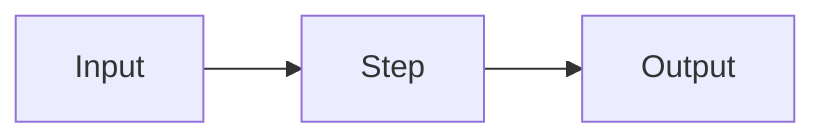

# Plan: <FEATURE / EFFORT NAME>

**Status:** Draft · **rev 1** · _<YYYY-MM-DD>_
**Owner:** <name/agent>
**Canonical:** this markdown is the SOURCE OF TRUTH. The sibling `<this-file>.html` and `<this-file>.tracker.html` are GENERATED from it by `scripts/render_plan` — never hand-edit the HTML.
**Global validation gate:** `<project test/lint command, e.g. pytest -q | npm test | cargo test>` — must pass before any phase is marked done.

> How to read this plan: each milestone is an independently reviewable PR landing in dependency order. A task is `[x]` only when its phase's Testing Strategy holds AND the global validation gate passes. This plan is adversarially reviewed BEFORE any code is written, and each milestone's diff is reviewed BEFORE merge.

**Status markers:** `[ ]` todo · `[wip]` in progress · `[x]` done · `[f]` failed / blocked _(renderer treats `[]` as `[ ]`)_

---

## 1. Goal & success criteria
- **Problem:** <what & why, 2–3 lines>
- **Done looks like:** <observable, testable outcomes>
- **Acceptance:** <how we know it shipped correctly>

## 2. Scope
- **In scope:** <…>
- **Non-goals (explicitly out):** <…>
- **Phasing (larger efforts only):**

  | Phase | Contents |
  |-------|----------|
  | v1       | <smallest shippable slice> |
  | v1.x     | <follow-ups> |
  | Deferred | <designed-for, not built yet> |

## 3. Decisions locked
_Settled choices; treat as fixed for the build._
1. **<decision>** → <resolution> _(<YYYY-MM-DD>)_

## 4. Approach / architecture
<short prose>. Diagram as code (rendered into the HTML view; no image API):

## 5. Milestones
_Each milestone = one reviewable PR → one release (see RELEASING.md), in dependency order._

### M1 — <name>  ·  → release `v0.1.0`  ·  depends on: none
**Outcome:** <one line: what exists after this PR that didn't before.>

#### Phase 1.1 — <name>
- [ ] <task>
- [ ] <task>
- **Testing Strategy:** <what proves this phase correct — the specific unit/integration/mock cases>.
- **Validation gate:** `<named command that must pass for this phase>`

#### Phase 1.2 — <name>
- [ ] <task>
- **Testing Strategy:** <…>
- **Validation gate:** `<command>`

**Review checkpoint:** adversarial review of this milestone's diff passes before merge (finders → skeptic verify).

### M2 — <name>  ·  → release `v0.2.0`  ·  depends on: M1
**Outcome:** <…>

#### Phase 2.1 — <name>
- [ ] <task>
- **Testing Strategy:** <…>
- **Validation gate:** `<command>`

**Review checkpoint:** adversarial review of this milestone's diff passes before merge.

## 6. Risks & open questions
- **<risk>** — <impact> · mitigation: <…> · status: open / closed.

## 7. Dependency order & first PR
- **Order:** M1 → M2 → …
- **First PR:** <which milestone(s) land first, and why that ordering is safe>.

## 8. Validation gates (summary)
| Milestone / phase | Gate command | Must hold |
|-------------------|--------------|-----------|
| M1.1              | `<cmd>`      | <…>       |

## Revisions
- rev 1 — <YYYY-MM-DD> — initial plan.
